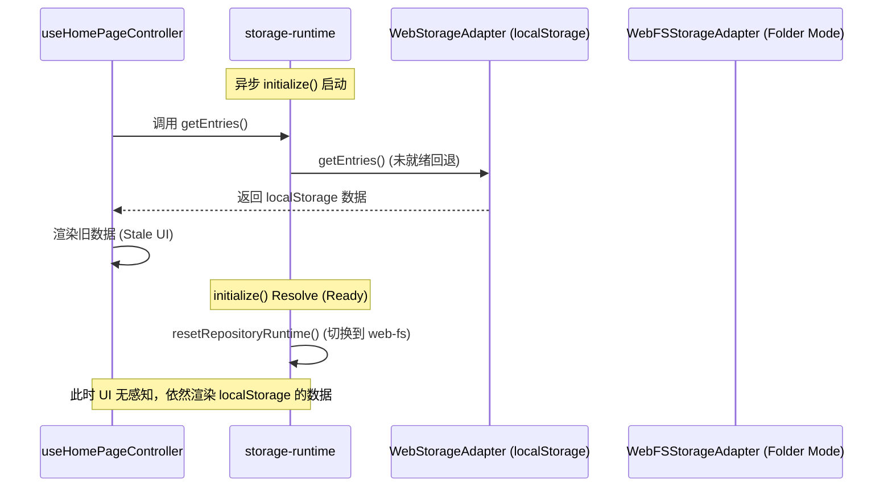

# 数据服务与存储层架构审计报告 (Data Layer Architectural Audit Report)

本报告针对 `src/services/` 和 `src/hooks/` 中的数据获取、草稿机制以及存储适配器运行时切换进行了全方位的架构审计，识别出多处竞态条件漏洞、移动端草稿逻辑缺陷及数据映射/错误捕获机制的不完善。

---

## 1. 存储适配器切换的竞态条件 (Race Condition Vulnerabilities)

在桌面 Web 端（Desktop Web）运行环境下，系统采用了一种静默的、异步的存储适配器自动升级升级机制。这种设计引入了严重的竞态条件和数据不一致风险：

### 1.1 页面初始化加载竞态 (Initial Load Race)
* **漏洞代码位置**：`src/services/storage-runtime.ts` 与 `src/hooks/useHomePageController.ts`
* **表现与机理**：
  1. 页面挂载时，`useHomePageController` 立即在 `useEffect` 中调用 `getEntries()` 试图加载数据。
  2. 此时，异步的 `sharedWebFS.initialize(true)` 探测操作正在进行，`sharedWebFS.isReady()` 依然返回 `false`。
  3. `getRepository()` 路由指向 `WebStorageAdapter` (Browser Local, 基于 `localStorage`)，页面加载并渲染本地浏览器的旧条目。
  4. 几十至几百毫秒后，`sharedWebFS.initialize` 探测完成并 resolve `true`，触发 `resetRepositoryRuntime()` 将当前存储模式升级为 `web-fs` (Folder Mode)。
  5. **缺陷**：重置后没有任何发布订阅机制或事件通知 React 层数据源已发生变更。UI 依然保留 `localStorage` 的旧数据，直至用户进行某些触发重新 Fetch 的写操作，此时列表才会突然被 WebFS 的条目完全替换，导致条目无故“消失”或“突变”。



### 1.2 草稿读写分离与数据错乱 (Draft Read/Write Discrepancy)
* **漏洞代码位置**：`src/hooks/useEntryEditorDraftBridge.ts`
* **表现与机理**：
  1. 在页面初始加载的短暂空档期，草稿桥接器 `useEntryEditorDraftBridge` 挂载，并通过 `draftStorage.get()` 读取了 `localStorage` 中的草稿。
  2. 随后，存储模式在后台被悄悄升级为 `web-fs`。
  3. 用户修改表单后，1.5 秒自动保存定时器触发，调用 `persistDraft` (即 `entryService.saveDraft`)。
  4. 此时 `getRepository()` 动态获取了最新的 `WebFSStorageAdapter` 实例，将草稿写入了本地文件夹的 `.draft.json` 中。
  5. **后果**：草稿的读取链路（来自浏览器缓存）和写入链路（写入本地磁盘）发生分裂。用户刷新页面重新加载时，又会先从 `localStorage` 读取草稿，导致其感到数据已丢失，直至文件夹完全重新连接。

---

## 2. 移动端 Draft 机制的脆弱性 (Mobile Draft Fragility)

移动端只允许使用浏览器本地草稿（Browser-Local Drafts），但当前的设计存在状态逻辑割裂和环境突变风险：

### 2.1 UI 视图与检测逻辑割裂
* **漏洞代码位置**：`useEntryEditorDraftBridge.ts`
* **表现与机理**：
  * 在草稿桥接器中，`draftStorage` 的行为完全基于传入的 `mobileDraftMode` 变量。
  * 该变量如果遇到响应式设计中的屏幕尺寸动态变化（例如桌面浏览器调整窗口大小时，`useMobileDevice` 会在运行时动态切换 `isMobileMode` 的值），会导致 `mobileDraftMode` 在 `true` 和 `false` 之间突变。
  * 这种突变导致草稿路由在 `IndexedDB` (`bibliotheca_mobile_draft`) 与当前适配器的草稿接口之间来回切换，从而造成草稿数据分流和丢失。

### 2.2 移动端草稿生命周期悬空
* **表现与机理**：
  * 移动端草稿被孤立在 IndexedDB 存储中，没有向桌面端归档合并或导出的任何链路。当用户在移动端编辑完后，若无手动导出备份的复杂操作，该草稿将永久驻留在当前浏览器中，无法通过任何自动检测机制与桌面端 Folder 模式同步。

---

## 3. 数据映射缺失与错误回退漏洞 (Missing Fallbacks & Lossy Mappings)

### 3.1 状态滞后与 UI 锁定 (UI State Lock)
* **漏洞代码位置**：`src/hooks/useDataManagementController.ts`
* **表现与机理**：
  * 代码采用 `const [storageMode] = useState(() => getStorageModeInfo())` 来缓存当前存储模式。
  * `useState` 的惰性初始化只会在组件挂载时执行一次。当用户点击连接文件夹，成功将适配器从 `web-local` 激活至 `web-fs` 时，`storageMode` 状态**根本不会更新**。
  * 同样，虽然 `refreshState` 会重新获取条目数和存储路径，但也从未更新该模式状态。这导致界面右上角的 Badge 和控制面板持续渲染陈旧的 `Browser Local` 状态，对用户形成极大误导。

### 3.2 粗暴的冲突解决与静默数据丢弃 (Lossy Import Merge)
* **漏洞代码位置**：`src/services/web-storage.ts`
* **表现与机理**：
  * 在导入备份数据时，系统对冲突的解决策略极度简陋。若备份中条目的 `id` 在本地已存在，系统直接使用 `exists` 跳过（`if (!exists) { merged.push(normalizedEntry); }`）。
  * **后果**：直接丢弃了备份文件中的新版本条目，无任何合并策略或覆盖提示，导致多设备备份同步时发生静默数据丢失。

### 3.3 图片数据映射隐患 (Image Mapping Failures)
* **漏洞代码位置**：`src/services/web-fs-storage.ts`
* **表现与机理**：
  * 当用户导入备份时，`prepareImportedEntry` 会尝试提取 `imageBase64` 并通过 `uploadImage` 将其转换为物理文件（如 `images/xxx.png`）。
  * 若此过程失败，代码仅通过 `console.warn` 打印警告，并退回到将巨大的 base64 字符串作为 `imageUrl` 存储。
  * 当执行 `saveEntry` 时，它会删除 `payloadToSave.imageBase64`。但如果图片以 base64 存在于 `imageUrl` 中，这会导致数兆字节的 base64 文本直接被编码进条目的 `.json` 主体文件中，极大拖慢单文件读写性能，并在读取大列表时导致内存瞬间溢出或进程崩溃。
  * 在 `WebStorageAdapter` 中，所有图片均以 base64 缓存在 `localStorage` 中。由于其容量限制为 5MB，只要有两张以上的高清图就会触发 `QuotaExceededError` 导致写入完全失效。

### 3.4 异常吞噬与故障排查困难 (Silent Exception Swallowing)
* **漏洞代码位置**：`src/services/web-fs-storage.ts`
* **表现与机理**：
  * 在读取条目（`readEntries`）中，若遇到某个 JSON 损坏或权限受限，系统仅仅在 console 打印警告，直接从数组中剔除该条目。这使用户的数据神秘失踪，而界面上没有任何数据损坏或修复的提示。
  * 在删除条目（`deleteEntry`）中，如果删除磁盘 JSON 文件成功，但由于系统原因删除关联图片失败，所有的异常也均被 `catch {}` 静默捕获，未提供任何事务性的回滚或错误告知。

---

## 4. 架构优化与接口简化建议 (Recommendations)

为解决上述架构设计漏洞，建议对数据存储层进行如下简化与重构：

### 4.1 引入订阅发布机制（存储观察者模式）
在 `storage-runtime.ts` 中设计一个轻量级的事件监听器。当适配器状态重置或切换时，广播事件：
```typescript
type StorageChangeCallback = (mode: StorageMode) => void;
const listeners = new Set<StorageChangeCallback>();

export const subscribeToStorageChange = (cb: StorageChangeCallback) => {
  listeners.add(cb);
  return () => listeners.delete(cb);
};

export const resetRepositoryRuntime = () => {
  repositoryInstance = null;
  currentStorageMode = null;
  const nextMode = getStorageMode();
  listeners.forEach(cb => cb(nextMode));
};
```
在 React Hooks 中订阅此事件，实现 UI 和数据加载的实时自动同步，彻底消除竞态带来的状态不一致。

### 4.2 统一的草稿管理接口 (Unified Draft API)
废弃在 Hook (`useEntryEditorDraftBridge`) 内部进行的 `mobileDraftMode` 分流逻辑。
在 `storage-repository` 层定义标准的 `Draft` 操作规范，统一由底层存储层根据宿主环境、设备类型自动调度：
* 桌面 Tauri：写 `.draft.json` 到 AppData 目录。
* 桌面 Web：如果连接了 Folder 则写入本地 `.draft.json`，未连接则写入 `localStorage`。
* 移动 Web：统一写入 IndexedDB。
这样做可以把草稿管理的复杂度限制在服务层内部，使 Hook 层完全无感知。

### 4.3 增加初始化锁与加载屏阻断 (Initialization Lock)
在 `sharedWebFS` 探测连接期间，React 顶层应维护一个全局的 `isStorageInitializing` 状态（如通过 React Context 或 Zustand）。
在初始化完成之前，锁定核心数据交互 UI 或显示微小的 loading 状态，阻塞 `loadUserEntries` 等操作的触发，直至存储适配器状态尘埃落定。

### 4.4 提升导入与冲突处理策略
* 导入合并时引入基本的冲突检测机制：若 `id` 冲突，比较两者的 `dateModified` 时间戳，或在 UI 上弹出提示，让用户选择覆盖或保留两个副本（通过重命名 ID）。
* 对超出 `localStorage` 限制的 base64 存储引入自动清理或压缩提示，防止整个系统因浏览器配额限制而无法写入数据。
